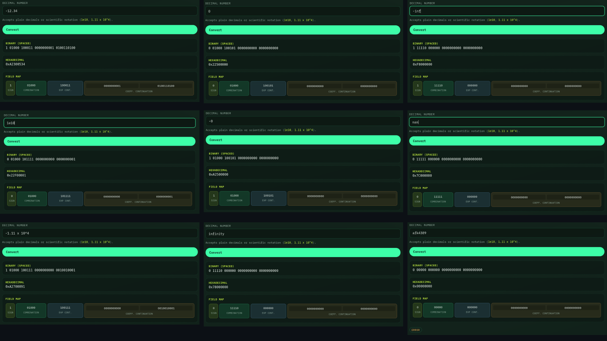
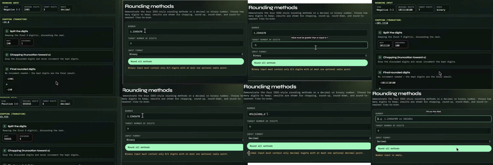
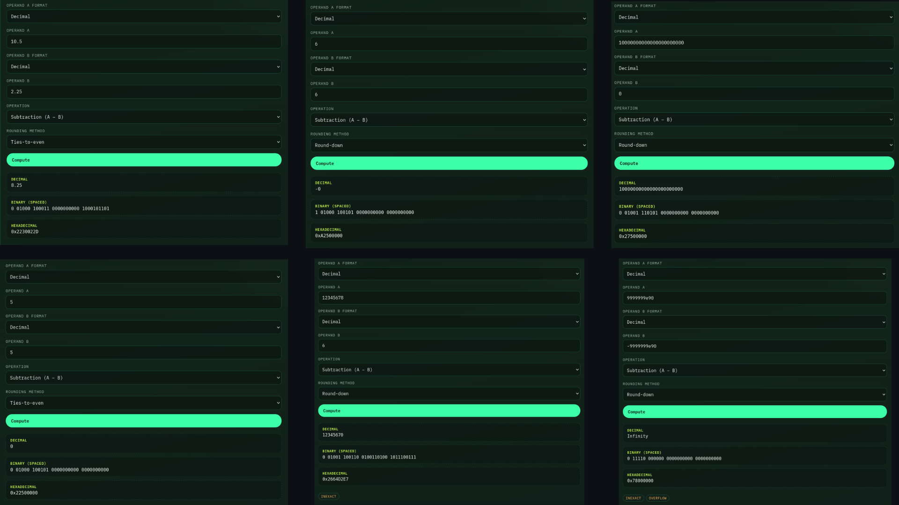
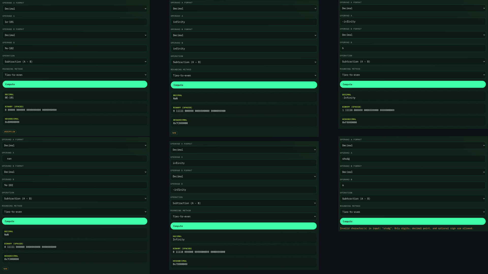
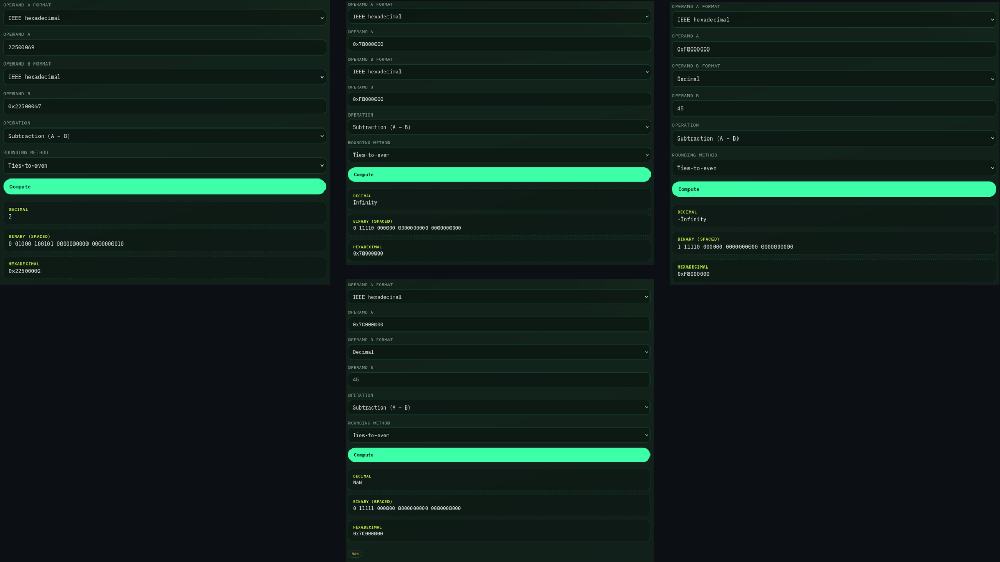
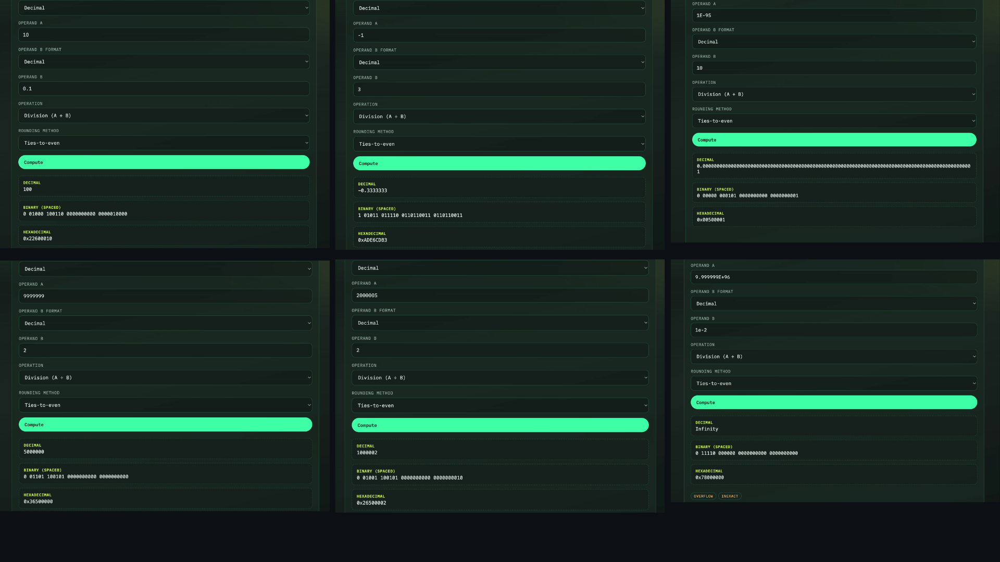

# Incremental README — Development Log

**Group 4:** Go, Justin · Leung, Jillianne · Luna, Jacoba · Montaño, Rovin · Teoxon, Jat  
**Machine:** Machine 4 — Decimal 32-bit Floating-Point Machine (IEEE 754 decimal32, DPD encoding)  
**Deployment Link:** [https://rovmont.github.io/CSARCH2-MACHINE-PROJECT-GROUP4/](https://rovmont.github.io/CSARCH2-MACHINE-PROJECT-GROUP4/)  
**Demo Video:** [https://youtu.be/HF_ltxEoCY8](https://youtu.be/HF_ltxEoCY8) 

---

## Things Done (Milestone Progress)

### July 30, 2026

- Project kickoff for CSARCH2 Simulation Project (Machine 4).
- Confirmed tech stack: Astro + Node + CSS + JavaScript.
- Chose **DPD (Densely Packed Decimal)** as the decimal32 significand encoding.
- Assigned task ownership across all five members (see Task Board below).
- Set-up Astro app foundation, shared CSS/layout, and feature pages with Feature 1–3 logic stubs.
- **Feature 1 (Justin):** Implemented decimal32 DPD encode/decode (`dpd.js`, `format`/`encode` pipeline), specials (±0, ±Inf, NaN), and convert outputs (spaced binary + hex).

### August 1, 2026

- **Feature 2 (Jillianne):** Implemented the four rounding methods in `rounding.js` (chopping, round-up, round-down, ties-to-even) plus shared `roundDigitString` for other features to reuse.
- Polished Round-page display so results show the formatted rounded value.

### August 2, 2026

- Rewrote the incremental README and aligned feature inputs with the Machine 4 specification (decimal-only convert; decimal/binary rounding; decimal or IEEE hex arithmetic via UI format selectors).
- Added shared arithmetic operand parsing (`arithmetic/operands.js`).
- Split the decimal32 library into focused folders (`format/`, `convert/`, `arithmetic/`).
- Made step-by-step explanation of outputs more visual.
- **Feature 3 - subtract (Jacoba)** Did full logic implementation of decimal32 subtraction, considering all likely testcases.
- **Feature 3 - divide (Jat)** Implemented the logic for decimal32 division

### August 3, 2026

- **Feature 3 - subtract (Jacoba)** Implemented proper visualization for subtract.
- Took existing step visualization code from subtract and conversion and centralized it into their own files for re-usability throughout website.
- **Feature 2 (Jillianne):** Implemented visualizations for rounding.
- **Feature 3 - divide (Jat)** redesigned to accommodate proper visualization for the step-by-step procedures
- Completed reflection for members Jacoba and Justin

### August 4, 2026

- Completed reflection for members Rovin, Jillianne, Jat.
- Completed demo video.

---

## Task Board


| Member           | Ownership            | Tasks                                                               | Status |
| ---------------- | -------------------- | ------------------------------------------------------------------- | ------ |
| Montaño, Rovin   | Foundation & design  | Set-up Astro/Node; CSS/layout; shared UI; deploy config; README     | Done   |
| Go, Justin       | Feature 1            | `format/`, `convert/`, `dpd.js` — DPD convert; specials; binary/hex | Done   |
| Leung, Jillianne | Feature 2            | `rounding.js` — four methods + shared `roundDigitString` API        | Done   |
| Luna, Jacoba     | Feature 3 — subtract | `arithmetic/subtract.js` — hex/decimal ops; steps; wire subtract    | Done   |
| Teoxon, Jat      | Feature 3 — divide   | `arithmetic/divide.js` — division specials/steps; wire divide       | Done   |


Status values: `Not Started` · `In Progress` · `Done`

---

## Machine Specification Summary

**Process:** IEEE 754 decimal single-precision (decimal32) operations.

1. **Convert** — input: decimal number → spaced binary + hex (specials).
2. **Rounding** — inputs: decimal or binary number + target digits → all four rounding methods.
3. **Arithmetic** — inputs: decimal or IEEE hex operands (format chosen in UI) + operation (sub/div) + rounding method → step-by-step + decimal / spaced binary / hex.

**decimal32 parameters used:** 32 bits · 7 significand digits · exponent bias 101 · emin −95 / emax 96 · DPD encoding.

---

## Local development

Instructions to run the web app locally:

```bash
npm install
npm run dev
npm run build
node scripts/smoke-test.mjs
```

App routes: `/` · `/convert/` · `/round/` · `/arithmetic/`  
(With GitHub Pages base path: `/CSARCH2-MACHINE-PROJECT-GROUP4/...`)

---

## Insights and Reflection

### Rovin

- **Aha moments / things learned:** Building on my experience with the virtual exhibit, I learned more about Astro and how it can work with formats and technologies beyond MDX. Although I stayed with MDX for this project, that experience also helped me use Astro with TypeScript in my personal projects. I also realized that understanding a lesson is one challenge, but presenting it visually in a way that others can easily follow is an even greater one. Thinking carefully about how each step should be explained taught me a lot about making technical concepts more accessible. It showed me that this application can be more than a machine project completed for compliance, and might be an actually useful learning tool.
- **Challenges faced:** Compared with our previous group project, we were better able to anticipate how tight and hectic everyone's schedules would be, so I took the lead in organizing and spearheading the baseline for the project. Even so, it was difficult to determine which responsibilities should be separated into their own tasks and how each feature should be broken down so that every member had a clear and manageable assignment. I used AI to help stub and outline the features, which made the intended structure and implementation path more intuitive for the group while leaving the actual feature work to each assigned member.
- **Creative contributions:** I created the application's base UI and visual design, and continued the retrofuturistic theme we established for the virtual exhibit. I also designed the visual step-by-step presentation for the Convert feature, which became the basis for presenting the other features. Much of my work focused on making the application intuitive despite decimal32's many input rules and validation requirements. We supported this through clearer parsing feedback and UI controls such as dropdowns and format selectors, reducing the number of rules that an end user has to remember.

### Justin

- **Aha moments / things learned:** My task was making the conversion from decimal to its equivalent IEEE decimal 32, after learning how to convert it manually I had to figure out how to do it via code, and realized it was quite lengthy, but after putting it all to place it worked well and fell nice to see what I learned how to do manually is now done automatically.
- **Challenges faced:** One challenge was thinking how to implement the conversion. As we learned how to do this in class manually, my task was to now translate the knowledge I learn into code that can do it automatically. One lengthy process was doing the DPD, as it has different rules base on what number is used. Though it was difficult initially, my knowledge on the topic was a good foundation in completing this task, the only one left that was needed was to convert it into code.
- **Creative contributions:** I implemented the logic for feature 1, which is the decimal to IEEE decimal 32 converter.

### Jillianne

- **Aha moments / things learned:** I was assigned to implement the rounding feature, which initially seemed relatively simple since the four rounding methods follow straightforward rules. However, I realized that translating these rules into code required careful consideration of different cases, especially when determining which digits should be retained or discarded. I also learned how important it is to make a function reusable, as creating a shared function allowed other features to use the same rounding logic instead of having to implement it separately.
- **Challenges faced:** One of the main challenges was ensuring that each rounding method behaved correctly for different values and edge cases. It was especially important to distinguish between chopping, round-up, round-down, and ties-to-even, since small differences in how the discarded digits are handled can produce different results. Another challenge was making the rounding process easy to understand visually, which required breaking down the process into clear steps.
- **Creative contributions:** I implemented the logic for Feature 2, which includes the four rounding methods, chopping, round-up, round-down, and ties-to-even. I also worked on the visual step-by-step explanation for rounding so that users can see how the input is processed and how the final result is obtained.

### Jacoba

- **Aha moments / things learned:** I was assigned to making subtraction, I originally thought that this would be pretty simple, and to some degree it is. The actual process of subtraction in decimal32 is relatively straightforward, and so was implementing it. The part of the implementation that took me the most time was considering the different test cases (having a result of greater than 8 digits, having infinity and NaN inputs) and the different flags (inexact, overflow, underflow). I will say however, that while this part of the implementation took me the most time and work, it was also the most insightful part. It's easy to oversimplify the process of something like floating-point decimal subtraction, because, well, it really is *just* subtraction. But having to actually implement and consider all these different factors made me grow a better appreciation and understanding of decimal32.
- **Challenges faced:** Like mentioned, the most difficult part of this project for me personally was considering all the different test cases. I think the most, not necessarily annoying, but the one that stumped me the most is when an 8 digit result is produced, rounded down to 7, but after rounding the carry causes another digit, making the result go back to 8 digits... In the end, another check for whether the result was within 7 digits was necessary. That being said though, the process of making this project went pretty smoothly.
- **Creative contributions:** I implemented the logic for subtraction, as well as the step visualization for it. Step visualization code prior was also all put in the respective .astro and .js files of some functions, and I edited it so that these functions are centralized throughout the code and usable by all functions that may need it.

### Jat

- **Aha moments / things learned:** I was assigned to implement division, and I already knew it was gonna be hard because I personally struggled learning it in class. Having to translate the same process but in a way that can be presented with code was another beast. Like the other members, I had to deal with the myriad of edge cases that my code had to account for. It took a while to even come up with an outline of how the code should work, and even more time to figure out what I needed to edit or work around.
- **Challenges faced:** The biggest challenge, somehow, was actually dealing with the step-by-step visualizations. I struggled for a long time in that aspect because cards are automatically numbered by their appearance; however, I had cards that did not even have their own numbers but still counted as separate cards, disturbing the flow from steps 1 - 4 until suddenly jumping to step 8.
- **Creative contributions:** I implemented the logic for division along with the code to help visualize the step-by-step process.

---

### AI Usage Disclosure

In the development of this output, Claude was used for documentation and guides for feature stubbing/to-dos. All technical claims and code for IEEE 754 decimal32 behavior are reviewed by the group against the course specification and standard references.

---

## Screenshots
Zooming in may prove necessary. The full screenshots are available in the screenshots folder. Additionally, these screenshots only show the final output, the detailed step-by-step process are available in the website.

### Conversion


### Rounding


### Subtraction




### Division
